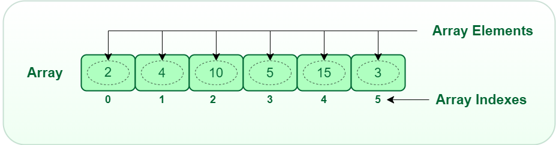
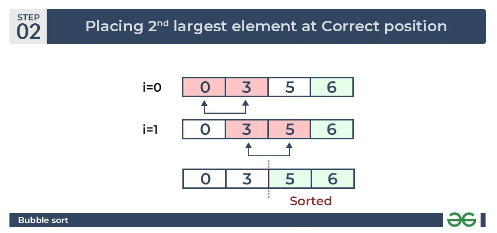

# Intro

This document serves as a descriptions of all algorithms contained in this
repository. These algorithms are adapted from
[ThePrimeagen](https://frontendmasters.com/teachers/the-primeagen/)
course on [FrontendMasters](https://frontendmasters.com/).

# Arrays

An array is a collection of items stored at contiguous memory locations. The
idea is to store multiple items of the same type together. This makes it easier
to calculate the position of each element by simply adding an offset to a base
value, i.e., the memory location of the first element of the array
(generally denoted by the name of the array).



For a vector with linear addressing, the element with index i is located at the
address B + c × i, where B is a fixed base address and c a fixed constant,
sometimes called the address increment or stride (where the stride is base off
of value type ie. u8 or i32).

If the valid element indices begin at 0, the constant B is simply the address
of the first element of the array. For this reason, the C programming language
specifies that array indices always begin at 0; mainly referenced as the
"zeroth" index rather than "first".

However, one can choose the index of the first element by an appropriate choice
of the base address B. For example, if the array has five elements, indexed 1
through 5, and the base address B is replaced by B + 30c, then the indices of
those same elements will be 31 to 35. If the numbering does not start at 0,
the constant B may not be the address of any element.

# Linear Search

Linear Search is defined as a sequential search algorithm that starts at one
end and goes through each element of a list until the desired element is found,
otherwise the search continues till the end of the data set.


Steps in a linear search:
1. Every element is considered as a potential match for the key and
checked for the same
2. If any element is found equal to the key, the search is successful and the
index of that element is returned
3. If no element is found equal to the key, the search returns None

Example with integers:
``` python
def linear_search(arr: List[int], target: int) -> Optional[int]:
    # loop through array -> i in range(len(arr))
    # if i == target return i
    # else return -1
```

# Binary Search
Binary Search is defined as a searching algorithm used in a sorted array by
repeatedly dividing the search interval in half. The idea of binary search is
to use the information that the array is sorted and reduce the time
complexity to O(log(N)).


Iterative approach
``` python
def binary_search(arr: List[int], target: int) -> Optional[int]
    # 1. Compare target with middle element

    # 2. if x matches with the middle element -> return
    #    middle index

    # 3. if x is greater than the middle element, then x
    #    can only be in the remaining right half after
    #    the middle element. Then apply the algorithm again

    # 4. if x is smaller than the middle element, then x can
    #    only be in the remaining left half before the middle
    #    element. Then apply the algoritm again
```

## Advantages of Binary Search:
* Binary search is faster than linear search, especially for large arrays.
* More efficient than other searching algorithms with a similar time
  complexity, such as interpolation search or exponential search.
* Binary search is well-suited for searching large datasets that
  are stored in external memory, such as on a hard drive or in the cloud.

## Drawbacks of Binary Search:
* The array should be sorted.
* Binary search requires that the data structure being searched be
  stored in contiguous memory locations.
* Binary search requires that the elements of the array be comparable,
  meaning that they must be able to be ordered.

## Applications of Binary Search:
* Binary search can be used as a building block for more complex
  algorithms used in machine learning, such as algorithms for training
  neural networks or finding the optimal hyperparameters for a model.
* It can be used for searching in computer graphics such as algorithms
  for ray tracing or texture mapping.
* It can be used for searching a database.


# Bubble Sort
Bubble sort is a very simple sorting algorithm that woks by repeatedly swapping
the adjacent elements if they are in the wrong order. This algorithm is not
suited for large data sets as its average and worst-case time complexity
is quite high.





Steps
``` python
def binary_search(arr: List[int], target: int) -> Optional[int]
    # 1. traverse from left and compare adjacent elements and the
    #    higher one is placed at right side

    # 2. In this way, the largest element is moved to the rightmost end at first

    # 3. This process is then continued to find the second largest and
    #    place it and so on until the data is sorted
```

## Advantages of Bubble Sort:
* Bubble sort is easy to understand and implement.
* It does not require any additional memory space.
* It is a stable sorting algorithm, meaning that elements with the same
  key value maintain their relative order in the sorted output.

## Disadvantages of Bubble Sort:
* Bubble sort has a time complexity of O(N2) which makes it very slow for large data sets.
* Bubble sort is a comparison-based sorting algorithm, which means that
  it requires a comparison operator to determine the relative order of
  elements in the input data set. It can limit the efficiency of the algorithm in certain cases.
